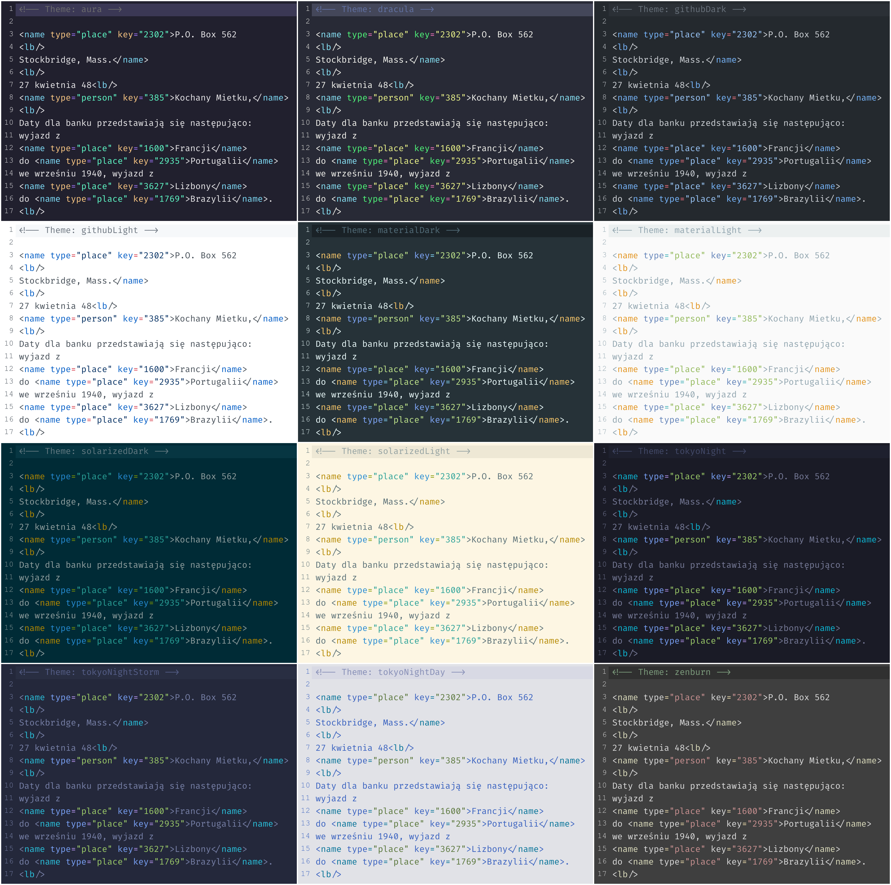

# Codemirror 6 Themes

Not perfect themes for cm6, generated from vscode themes.



## Install

```bash
npm i @ddietr/codemirror-themes
```

## Usage

```javascript
import {materialLight} from '@ddietr/codemirror-themes/material-light'
import {materialDark} from '@ddietr/codemirror-themes/material-dark'
import {solarizedLight} from '@ddietr/codemirror-themes/solarized-light'
import {solarizedDark} from '@ddietr/codemirror-themes/solarized-dark'
import {dracula} from '@ddietr/codemirror-themes/dracula'
import {githubLight} from '@ddietr/codemirror-themes/github-light'
import {githubDark} from '@ddietr/codemirror-themes/github-dark'
import {aura} from '@ddietr/codemirror-themes/aura'
import {tokyoNight} from '@ddietr/codemirror-themes/tokyo-night'
import {tokyoNightStorm} from '@ddietr/codemirror-themes/tokyo-night-storm'
import {tokyoNightDay} from '@ddietr/codemirror-themes/tokyo-night-day'
```

## Dev

```
# Start devserver with examples
npm run dev
```

## Build

```bash
go build
./codemirror-themes
npm i
```

## [Old Codemirror Themes](https://codemirror.net/5/demo/theme.html)

- 3024-day
- 3024-night
- abcdef
- ambiance
- ambiance-mobile
- base16-dark
- base16-light
- bespin
- blackboard
- cobalt
- colorforth
- dracula
- eclipse
- elegant
- erlang-dark
- hopscotch
- icecoder
- isotope
- lesser-dark
- liquibyte
- material
- mbo
- mdn-like
- midnight
- monokai" selected="
- neat
- neo
- night
- paraiso-dark
- paraiso-light
- pastel-on-dark
- railscasts
- rubyblue
- seti
- solarized
- the-matrix
- tomorrow-night-bright
- tomorrow-night-eighties
- ttcn
- twilight
- vibrant-ink
- xq-dark
- xq-light
- yeti
- zenburn

## Target Codemirror Themes

- [x] dracula
- [x] zenburn
- [x] material
- [ ] aura
- [ ] tokyo
- [ ] github
- [ ] one dark pro
- [ ] shades of purple?
- [ ] pastel-on-dark
- [ ] monokai
- [ ] rubyblue
- [ ] cobalt
- [ ] blackboard
- [ ] ayu
- [ ] nord
- [ ] gruvbox-dark
- [ ] gruvbox-light
- [ ] panda-syntax
